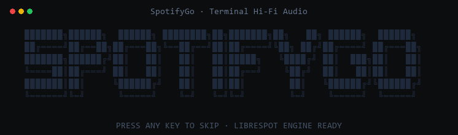
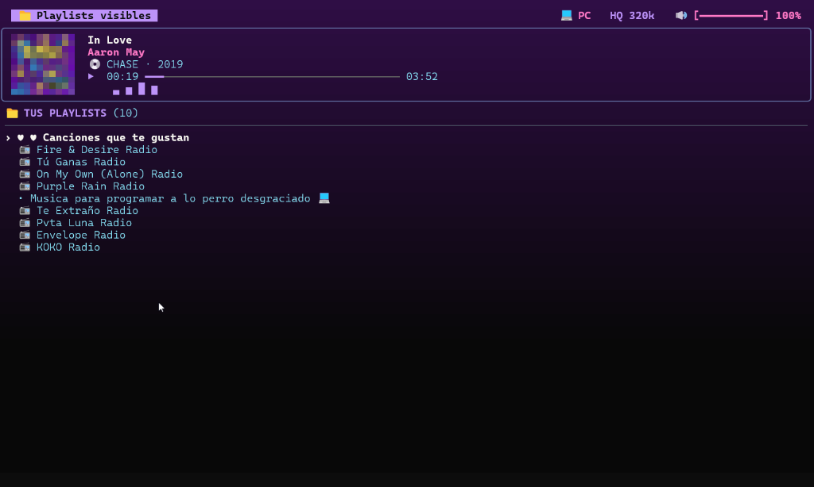
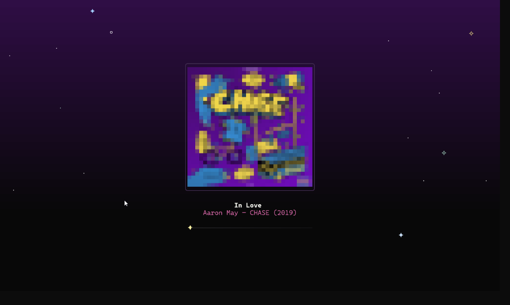

# SpotifyGo

<p align="center">
  
</p>

<p align="center">
  <strong>El reproductor y cliente de Spotify en terminal (TUI) de nueva generación, ultra-ligero y de alta fidelidad.</strong>
</p>

<p align="center">
  <a href="https://golang.org"></a>
  <a href="https://charm.sh"></a>
  <a href="https://charm.sh"></a>
  <a href="https://github.com/librespot-org/librespot"></a>
  <a href="https://developer.spotify.com"></a>
  <a href="LICENSE"></a>
</p>

---

## Instalación Rápida (1 Solo Comando)

En tu terminal de **PowerShell** (ejecutada como usuario normal), copia y pega este comando:

```powershell
irm https://raw.githubusercontent.com/VictorTrab/SpotyGo/main/scripts/install.ps1 | iex
```

El script se encarga de todo el proceso de forma 100% desatendida:
- Detecta si tienes **Go** instalado; si no está, lo descarga e instala automáticamente.
- Detecta si tienes **Rust/Cargo** y el motor de audio **librespot**; si no están, los descarga y compila automáticamente.
- Descarga el código fuente de SpotifyGo, lo compila y lo ubica en tu carpeta de binarios de usuario (`go\bin`), agregándolo a tu variable `PATH`.
- Requiere únicamente una cuenta de **Spotify Premium** (necesaria para el streaming nativo de audio vía Spotify Connect).

---

## Capturas de Pantalla

### Vista Principal (Reproductor TUI + Tarjeta Now-Playing + Playlists)
Fondo degradado estático basado en la carátula, metadatos completos de álbum y año, barra de progreso y navegación por tus listas.

<p align="center">
  
</p>

### Modo Zen / Big Cover Art (tecla `z`)
Visualización inmersiva con carátula TrueColor ampliada y cielo nocturno con estrellas titilantes en tiempo real.

<p align="center">
  
</p>

---

## Características Principales

- **Reproducción Nativa de Alta Fidelidad (HQ 320k):** Motor de streaming integrado con calidad fija de 320k.
- **Carátulas TrueColor en ANSI (`▀`):** Rasterizador de semibloques que despliega carátulas nítidas directamente en la terminal.
- **Modo Zen Sanctuary (`z`):** Experiencia minimalista con carátula ampliada y un cielo de estrellas vivas generadas proceduralmente.
- **Fondos independientes por modo:** La interfaz normal es estática para evitar repintados decorativos; `gradient` usa los colores de la carátula y `dark` el fondo del tema. `flow` conserva su animación y solo se mueve en Zen, con su propio reloj; la paleta mantiene el contraste del texto (WCAG ≥ 4.5:1).
- **Sincronización Remota Instantánea:** Sondeo adaptativo del estado de reproducción con sondeo de frontera y refresco al pulsar una tecla, de modo que una canción cambiada desde el teléfono aparece en segundos.
- **Caché en 2 Niveles (0.0 ms):** Sistema de almacenamiento en memoria RAM y disco SSD para metadatos y carátulas. Cero llamadas redundantes y prevención de bloqueos HTTP 429.
- **Eco-Power Zero-Idle:** Detección de foco de terminal (`xterm 1004h`). Cuando la ventana no está activa, el consumo de CPU desciende al **0.0%** sin detener la música.
- **Navegación Fluida y Paleta de Comandos (`/`):** Control estilo Vim (`j`/`k`, `p`, `Space`), búsqueda difusa en tiempo real y buscador de comandos interactivo.
- **Seguridad y Privacidad Absoluta:** Autenticación mediante **OAuth 2.0 PKCE** local. Ninguna credencial, contraseña ni token personal sale de tu equipo.

---

## Primeros Pasos

### 1. Iniciar Sesión por Primera Vez
Ejecuta en tu terminal:

```bash
spotifygo login
```

Se abrirá una ventana de navegador solicitando autorización en Spotify. La aplicación usa el flujo estándar y seguro de OAuth 2.0 PKCE en bucle local (`http://127.0.0.1:8989/login`).

### 2. Abrir SpotifyGo
Una vez autenticado, simplemente ejecuta:

```bash
spotifygo
```

SpotifyGo iniciará el motor de audio en segundo plano y comenzará la reproducción en tu computadora de forma inmediata.

### 3. Actualizar a la Última Versión
Para actualizar SpotifyGo a la versión más reciente en cualquier momento:

```bash
spotifygo update
```

Para consultar la versión instalada:

```bash
spotifygo version
```

Para diagnosticar la cuenta, los permisos y el estado de la API (incluye si Spotify aún concede el análisis de audio):

```bash
spotifygo doctor
```

Para consultar o fijar el fondo desde la terminal, sin abrir la interfaz:

```bash
spotifygo background          # muestra el modo actual
spotifygo background flow     # o gradient / dark
```

---

## Controles y Atajos de Teclado

### Controles Básicos
| Tecla | Acción |
| :--- | :--- |
| `Espacio` | Reproducir / Pausar |
| `n` / `→` | Siguiente canción |
| `p` / `←` | Canción anterior |
| `+` / `-` | Subir / Bajar volumen (en pasos de 5%) |
| `m` | Alternar Silencio / Mute (restaura volumen anterior) |
| `t` | Abrir selector interactivo de temas de color |
| `j` / `↓` | Mover cursor hacia abajo |
| `k` / `↑` | Mover cursor hacia arriba |
| `Enter` | Abrir playlist seleccionada / Reproducir canción |
| `Esc` | Volver a la vista de playlists / Cerrar modal |
| `z` | Alternar Modo Zen con cielo estrellado |
| `S` | Búsqueda directa de canciones |
| `/` o `?` | Abrir Paleta de Comandos interactiva |
| `q` / `Ctrl+C` | Salir de SpotifyGo |

### Comandos de la Paleta (`/`)
Escribe `/` para acceder a las acciones que no tienen un atajo directo en el footer:

- `/background [flow|gradient|dark]` (alias `/bg`) — Cambia el estilo de fondo.
- `/login` — Inicia sesión o cambia la cuenta de Spotify.
- `/update` — Comprueba e instala la última actualización disponible.
- `/changelog` — Muestra las novedades y cambios recientes.
- `/version` — Muestra la versión instalada.
- `/help` — Muestra los atajos de teclado y los comandos de esta paleta.

La reproducción, búsqueda, playlists, dispositivos, volumen, temas, modo Zen y salida se controlan desde sus atajos de teclado y no se duplican en esta paleta.

---

## Compilación Manual desde el Código Fuente

Si prefieres clonar y compilar el proyecto manualmente:

```powershell
# Clonar el repositorio
git clone https://github.com/VictorTrab/SpotyGo.git
cd SpotyGo

# Ejecutar las pruebas unitarias (64 tests)
go test -v ./...

# Compilar el binario ejecutable
go build -o spotifygo.exe .

# Mover a tu carpeta de binarios en el PATH (opcional)
Copy-Item spotifygo.exe "$env:USERPROFILE\go\bin\spotifygo.exe"
```

Para más detalles sobre los componentes internos y el flujo de datos, consulta la [Documentación de Arquitectura](docs/architecture.md).

---

## Licencia

Este proyecto está bajo la licencia libre y abierta **MIT**. Consulta el archivo [LICENSE](LICENSE) para más detalles.

---

<p align="center">
  Desarrollado para la comunidad de terminal por <a href="https://github.com/VictorTrab">VictorTrab</a>
</p>
